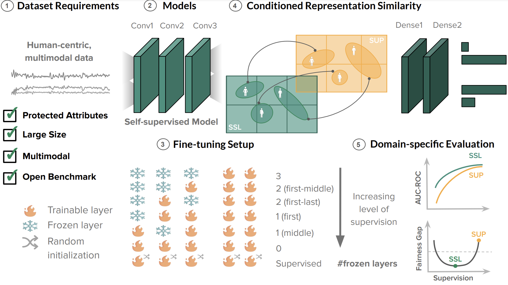

# Using Self-supervised Learning can Improve Model Fairness

#### :globe_with_meridians: [Project website](https://dispathis.com/SSLfairness)

 :book: Paper: Yfantidou, M., Spathis, S., Constantinides, D., Vakali, A., Quercia, D. and Kawsar, F., 2023. <b>[Using Self-supervised Learning can Improve Model Fairness](https://arxiv.org/abs/2406.02361)</b>. Proceedings of the 30th ACM SIGKDD Conference on Knowledge Discovery and Data Mining.

## Overview 

This repository contains three dataset processing pipelines and the code of self-supervised models (along with fully supervised baselines) for the paper *Using Self-supervised Learning can Improve Model Fairness*. 
Hypothesizing that SSL models would learn more generic, hence less biased representations, this study explores the impact of pre-training and fine-tuning strategies on fairness. We introduce a fairness assessment framework for SSL, comprising five stages: defining dataset requirements, pre-training, fine-tuning with gradual unfreezing, assessing representation similarity conditioned on demographics, and establishing domain-specific evaluation processes.
We evaluate our method's generalizability on three real-world human-centric datasets (i.e., MIMIC, MESA, and GLOBEM) by systematically comparing hundreds of SSL and fine-tuned models on various dimensions spanning from the intermediate representation to appropriate evaluation metrics. Our overall framework is shown in the following figure: 

<p align="center">
    
</p>


<!-- Please consult our paper for more details about our model and the experiments. -->

## Datasets

We prepared three datasets to compare our method against baselines. The tasks include mortality prediction, sleep-wake classification, and depression detection using high-dimensional signals. 

### Raw data

(1) **MIMIC** contains more than 31 million clinical events that correspond to 17 clinical variables (e.g., heart rate, oxygen saturation, temperature). Our task involves the prediction of in-hospital mortality from observations recorded within 48 hours of an intensive care unit (ICU) admission--a primary outcome of interest in acute care. Following the benchmark preparation workflow by Harutyunyan et al., we proceed with a total of 18.1K users, forming 21.1K windows, each with 48 timestamps, 76 channels, and no overlap.

(2) **MESA** contains polysomnography (PSG) and actigraphy data for 1817 out of the initial 2.2K users in the MESA sleep study, based on the benchmark by Palotti et al. Our task involves the classification of sleep-wake stages over overnight experiments split into 30-s epochs, forming a total of more than 2.2M windows, each with 101 timestamps, 5 channels, and maximum overlap.

(3) **GLOBEM** contains a rich collection of survey and behavioral data, including location, phone usage, physical activity, and sleep, for 497 unique users monitored over four consecutive years for 3-month periods at a time. Our task involves depression detection (self-reported), given a feature matrix including daily feature vectors for the past four weeks. Following the benchmark preparation workflow by Xu et al., we proceed with a total of more than 8K windows, each with 28 timestamps, and 1390 channels. 

The raw datasets are not included in this repository, as they are protected access, meaning interested parties have to comply with certain requirements to gain (free) access.

### Processed data

We describe the data preprocessing pipeline and highlight some steps here for clarity. More details can be found in the paper. Steps:

- **First**, we prepare the datasets for the deep learning pipelines based on previous benchmarks for reproducibility purposes ([MIMIC](https://github.com/YerevaNN/mimic3-benchmarks), [MESA](https://github.com/joaopalotti/sleep_awake_benchmark), and [GLOBEM](https://github.com/UW-EXP/GLOBEM)). 
- **Second**, given that the benchmark pipelines follow different formats, we bring all datasets into a common 3D format (i.e., `(samples, timesteps, features`)). Please check the respective Jupyter notebooks in this repository ([MIMIC](/data_processing/transformation_MIMIC.ipynb), [MESA](/data_processing/transformation_MESA.ipynb), and [GLOBEM](/data_processing/transformation_GLOBEM.ipynb)).   
- **Third**, we prepare the datasets as input to a SimCLR model, as per the suggested transformations by Tang et al., using the [SimCLR preprocessing file](/data_processing/SimCLR.py).

## Experimental setups
We evaluated our model in two different learning paradigms (self-supervised vs. supervised) and in comparison to seven experimental setups (depending on the learning paradigm and freezing strategy). 

We evaluated the self-supervised models utilizing the SimCLR algorithm as follows: 
First, we used the [train_model.py](/code/baselines/SimCLR/train_model.py) script for training SimCLR's base encoder for each dataset. 
Then, we run the [train_model_freeze_alternatives.py](/code/baselines/SimCLR/train_model_freeze_alternatives.py) script for experimenting with different freezing strategies. 
Finally, we evaluated model fairness through respective Jupyter notebooks per dataset ([MIMIC](/code/baselines/SimCLR/evaluate_model_fairness_mimic.ipynb), [MESA](/code/baselines/SimCLR/evaluate_model_fairness_mesa.ipynb), and [GLOBEM](/code/baselines/SimCLR/evaluate_model_fairness_globem.ipynb)).

In the supervised paradigm, we utilized the [train_model.py](/code/baselines/Supervised/train_model.py) script under the respective `Supervised` subfolder. 
Note that, due to data imbalance, we used a separate script for the GLOBEM dataset with slightly modified architecture, namely [train_model_globem.py](/code/baselines/Supervised/train_model_globem.py) script placed under the respective `Supervised` subfolder.

## Requirements

Our framework has been tested using Python >=3.8.

For the baselines, we have not unified the environments due to some divergence in the original baseline implementations. So you need to set up different environments to cover all three baselines. 
To create an environment in order to run the scripts in this repository, use the following command:

`pip install -r requirements.txt `

## Citation

If you find this work useful for your research, please consider citing this paper:

```
@inproceedings{sslfairness2024,
title = {Using Self-supervised Learning can Improve Model Fairness},
author = {Yfantidou, Sofia and Spathis, Dimitris and Constantinides, Marios and Vakali, Athena and Quercia, Daniele and Kawsar, Fahim},
booktitle = {Proceedings of the ACM SIGKDD International Conference on Knowledge Discovery and Data Mining},
year      = {2024}
}
```

## Miscellaneous

Please send any questions you might have about the code and/or the algorithm to [Sofia Yfantidou](mailto:syfantid@csd.auth.gr).

Any code taken from online repositories includes a copyright claim at the top of the script.


